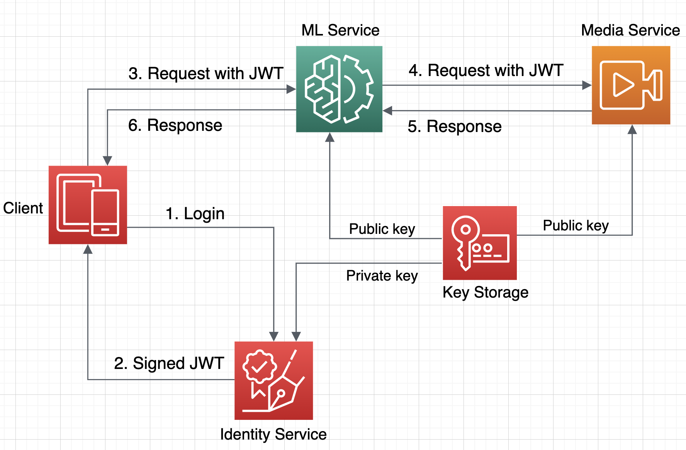

## Authentication for microservice applications



## Prototype
This folder has two simple microservice applications
- `login-service`
- `calc-service`

a key storage folder `keys-storage` and a client application `front-end`.

## Login Service
This service has a single endpoint `POST /login` accepting two params: `uesername` and `password`.
It finds a user with the given username and checks whether or passowrds match.
If the authentication is successful then it generates a JWT, having the user id as a payload,
signs it with a private key dowloaded from the storage and returns the token as a response.

## Calc Service
This service has four endpoints
- `GET /calc/add`
- `GET /calc/mul`
- `GET /calc/sub`
- `GET /calc/div`
with two params: `x` and `y`. For example, `GET /calc/add?x=1&&y=2`
These endpoints expect the `Authorization` header to be present having a valid jwt
obtained from the login service upon successfull authentication.
If the jwt is malformed or missing it returns an error response, otherwise
it tries to verify the jwt using a public key downloaded from the key storage.
If the verification is successful, it returns the result of calculation,
otherwise it returns an error response.

## Key storage 
It is a simple `key-storage` folder containing public and private keys.
In production, services, except identity service,
shouldn't have an access to the private keys.

## How to run
Navigate into each service folders and start applications by
```
bundle exec puma -e production
```
The login service listens to the port 3000 and calc service listens to the port 3001.

## Client (front end)
The front end application imitates a client requests.
It first sends a request with a user name and password pair to the login service
gets authenticated and receives a jwt. Then it sends a request to the calculator service
together with the jwt and gets calculation result. All requests and responses are logged
to the STDOUT.

Navigate into the front-end folder and run the application by `ruby app.rb`. 
This file covers various scenarious, i.e., happy path, missing token, etc.


## Further research
1. Using JWK sets
2. Implement Identity service based on AWS Cognito
3. Prototyping Event-driven communication between microservices (AWS SNS, Apache Kafka, RabitMQ)
